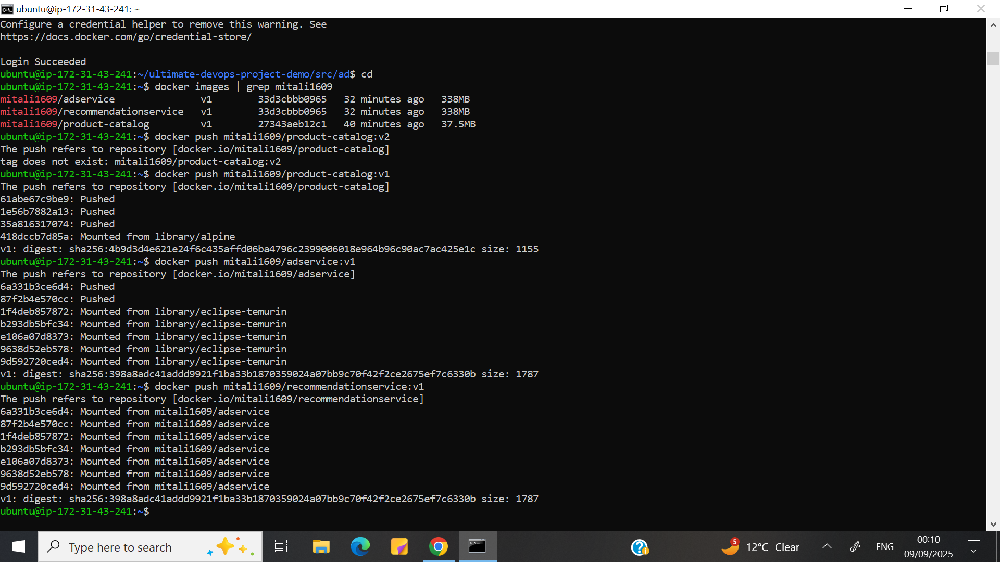
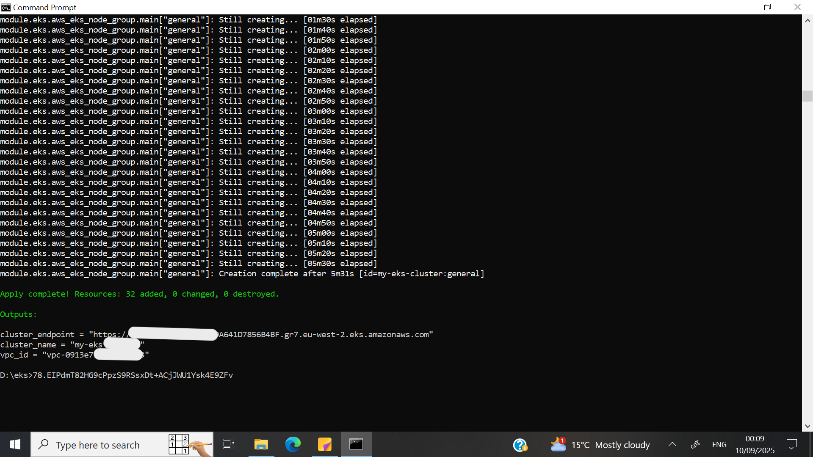
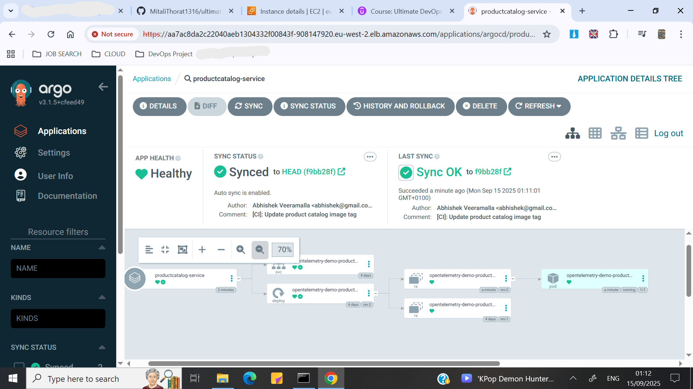

# DevOps-Automation-for-E-Commerce-Application-on-AWS
This project delivers the full DevOps lifecycle of an open-source e-commerce application (OpenTelemetry Astronomy Shop) by deploying 20+ microservices on AWS, simulating real-world cloud-native infrastructure and release workflows.

## Table of Contents
- [Project Highlights](#project-highlights)
- [Project Techstack](#project-techstack)
- [Project Implementation](#project-implementation)
  - [Installations and Prerequisites](#installations-and-prerequisites)
  - [Containerization of the Project](#containerization-of-the-project)
  - [Infrastructure as Code Using Terraform](#infrastructure-as-code-using-terraform)
  - [Deploying Project in Kubernetes](#deploying-project-in-kubernetes)
  - [Custom Domain Configuration for the Project](#custom-domain-configuration-for-the-project)
  - [Continuous Integration and Continuous Delivery (CI/CD)](#continuous-integration-and-continuous-delivery-cicd)
- [Socials](#socials)

# Project Highlights

- Implements secure and scalable cloud access by creating AWS IAM users, generating access keys via AWS CLI, and launching Ubuntu EC2 instances with SSH connectivity.  
- Containerizes microservices using Docker, building and pushing images to Docker Hub for consistent and repeatable deployments.  
- Provisions infrastructure with Terraform (IaC), utilizing an S3 remote backend and DynamoDB for state locking to ensure safe, collaborative management.  
- Orchestrates microservices on Amazon EKS using Kubernetes manifests and Helm charts, with services and deployments configured for high availability and scalability.  
- Sets up a custom VPC during EKS cluster creation, defining subnets, route tables, and security groups to provide isolated and secure networking.  
- Manages external traffic routing through an ALB Ingress Controller and custom domain integration via GoDaddy and Route 53 for production-grade accessibility.  
- Automates end-to-end CI/CD pipelines with GitHub Actions and Argo CD, enabling GitOps-based delivery to accelerate deployments and reduce manual effort.  

# Project Techstack

- Cloud platform - AWS
- AWS services - AWS IAM users, AWS CLI, EC2 instance, S3, DynamoDB, Amazon EKS, VPC, Route 53       
- Containerisation - Docker, Docker Hub
- Infrastructure as code - Terraform
- Container orchestration - Kubernetes
- Traffic routing - ALB Ingress Controller
- Domain integration - GoDaddy
- DNS management - Route 53
- CI - GitHub Actions
- CD - Argo CD

# Project Implementation

## Installations and Prerequisites

- Create AWS account
  - Go to [AWS sign-up page](https://signin.aws.amazon.com/signup?request_type=register) and follow the steps
  - You'll need a debit or credit card
  - This will be your root user account
 
***In the root user account***
    
- Create an IAM user with required permissions
  - AWS console -> IAM dashboard -> users -> Create user ->  Name- devops-user -> Provide user access to the AWS Management Console - Allow -> Custom password ->
    Users    must create a new password at next sign-in - don't allow -> Next -> Set permissions - Attach policies directly -> Permissions policies - AdministratorAccess -> Next -> Create user -> Download .csv file

***In the IAM user account***
      
- Create an EC2 instance
  - Region - London (eu-west-2)
  - AWS console -> EC2 dashboard -> Launch instance -> Name - devops-demo -> AMI - Ubuntu -> Instance type - t2.large -> Create new key pair - devops-demo(name), RSA,
      .pem, create key pair (the devops-demo.pem file will we downloaded on your machine) -> Network settings - auto-assign public IP(enabled), Allow SSH traffic -> Launch Instance
      
- SSH into the EC2 instance
  - Once the Instance state is "running", click on the Instance and copy the "Public IPv4 address"
  - Go to your machine's command-line tool (for me it's command prompt)
  - In cmd, go to the folder where devops-demo.pem file in downloaded
  - Run ```ssh -i devops-demo.pem ubuntu@<IPv4 address> ``` , ubuntu is the default username for AWS EC2 with ubuntu AMI
  - If it doesn't work, Run ```chmod 400 devops-demo.pem``` and try again

***In the EC2 instance:***

- Install Docker
  - [Install Docker engine](https://docs.docker.com/engine/install/)
  - Go to "Install using the apt repository section" and follow the steps
  - or run
    ```bash
    # Add Docker's official GPG key:
    sudo apt-get update
    sudo apt-get install ca-certificates curl
    sudo install -m 0755 -d /etc/apt/keyrings
    sudo curl -fsSL https://download.docker.com/linux/ubuntu/gpg -o /etc/apt/keyrings/docker.asc
    sudo chmod a+r /etc/apt/keyrings/docker.asc
            
    # Add the repository to Apt sources:
    echo \
    "deb [arch=$(dpkg --print-architecture) signed-by=/etc/apt/keyrings/docker.asc] https://download.docker.com/linux/ubuntu \
    $(. /etc/os-release && echo "${UBUNTU_CODENAME:-$VERSION_CODENAME}") stable" | \
    sudo tee /etc/apt/sources.list.d/docker.list > /dev/null
    sudo apt-get update

    # Install the Docker packages:
    sudo apt-get install docker-ce docker-ce-cli containerd.io docker-buildx-plugin docker-compose-plugin

    # Verify that the installation is successful by running the hello-world image:
    sudo docker run hello-world
    ```
  - Use ```sudo docker ps``` to check installation
  - To grant access of docker to Ubuntu use ```sudo usermod -aG docker ubuntu```, then you can directly run ```docker ps```
  
- Install Kubectl
  - [Install kubectl](https://kubernetes.io/docs/tasks/tools/)
  - Go to "Install kubectl on Linux -> Install kubectl binary with curl on Linux' then follow the steps
  - Or run:
    ```bash
    # Download the latest release with the command:
    curl -LO "https://dl.k8s.io/release/$(curl -L -s https://dl.k8s.io/release/stable.txt)/bin/linux/amd64/kubectl"

    # Validate the binary:
    curl -LO "https://dl.k8s.io/release/$(curl -L -s https://dl.k8s.io/release/stable.txt)/bin/linux/amd64/kubectl.sha256"

    # Validate the kubectl binary against the checksum file:
    echo "$(cat kubectl.sha256)  kubectl" | sha256sum --check

    # Install kubectl
    sudo install -o root -g root -m 0755 kubectl /usr/local/bin/kubectl

    # Test to ensure the version you installed is up-to-date:
    kubectl version --client
    ```
- Install Terraform
  - [Install terraform](https://developer.hashicorp.com/terraform/tutorials/aws-get-started/install-cli)
  - Go to "Install terraform -> Linux -> Ubuntu/Debian" and follow the steps
  - Or run:
    ```bash
    # HashiCorp's Debian package repository.
    sudo apt-get update && sudo apt-get install -y gnupg software-properties-common

    # Install HashiCorp's GPG key.
    wget -O- https://apt.releases.hashicorp.com/gpg | \
    gpg --dearmor | \
    sudo tee /usr/share/keyrings/hashicorp-archive-keyring.gpg > /dev/null

    # Verify the GPG key's fingerprint.
    gpg --no-default-keyring \
    --keyring /usr/share/keyrings/hashicorp-archive-keyring.gpg \
    --fingerprint

    # Add the official HashiCorp repository to your system.
    echo "deb [arch=$(dpkg --print-architecture) signed-by=/usr/share/keyrings/hashicorp-archive-keyring.gpg] https://apt.releases.hashicorp.com $(grep -oP '(?<=UBUNTU_CODENAME=).*' /etc/os-release || lsb_release -cs) main" | sudo tee /etc/apt/sources.list.d/hashicorp.list

    # Update apt to download the package information from the HashiCorp repository.
    sudo apt update

    # Install Terraform from the new repository.
    sudo apt-get install terraform

    # Verify the Installation
    terraform -help
    ```

- Configure AWS CLI using access keys
  - Open IAM user AWS account -> click on devops-user dropdown on the upper right hand side corner -> Security credentials -> scroll down to access keys ->
    create access  keys -> Use case - CLI -> next -> tag - terraform -> create access key -> Copy the "access key" and "secret access key" and keep somewhere safe ->
    or just download the .csv file
  - Go to "[AWS CLI](https://aws.amazon.com/cli/) page  -> get started -> install/update -> Windows (or your OS)" and follow the steps
  - Or run
    ```
    sudo apt install unzip -y
    
    sudo curl "https://awscli.amazonaws.com/awscli-exe-linux-x86_64.zip" -o "awscliv2.zip"
    unzip awscliv2.zip
    sudo ./aws/install
    
    aws --version
    ```
  - Run ```aws configure``` -> enter "access key" and "secret access key" -> region - eu-west-2
 
- Install eksctl
  - [Install eksctl](https://docs.aws.amazon.com/eks/latest/eksctl/installation.html)
  - Go to "Install eksctl -> For Unix" and follow the the steps 
  - Or run
    ```
    ARCH=amd64
    PLATFORM=$(uname -s)_$ARCH
    
    curl -sLO "https://github.com/eksctl-io/eksctl/releases/latest/download/eksctl_$PLATFORM.tar.gz"
    
    # (Optional) Verify checksum
    curl -sL "https://github.com/eksctl-io/eksctl/releases/latest/download/eksctl_checksums.txt" | grep $PLATFORM | sha256sum --check
    
    tar -xzf eksctl_$PLATFORM.tar.gz -C /tmp && rm eksctl_$PLATFORM.tar.gz
    
    sudo install -m 0755 /tmp/eksctl /usr/local/bin && rm /tmp/eksctl

    eksctl version
    ```

- Install helm
  - [Install helm](https://helm.sh/docs/intro/install/)
  - Go to "Install helm -> From Script" and follow the steps
  - Or run
    ```
    curl -fsSL -o get_helm.sh https://raw.githubusercontent.com/helm/helm/main/scripts/get-helm-3
    chmod 700 get_helm.sh
    ./get_helm.sh
    ```

## Containerization of the project

- Clone the repository on your EC2 instance  
  - Go to "[GitHub](https://github.com/MitaliThorat1316/DevOps-Automation-for-E-Commerce-Application-on-AWS) -> Code -> HTTPS" and copy the repository URL
  - Or just copy this ``` https://github.com/MitaliThorat1316/DevOps-Automation-for-E-Commerce-Application-on-AWS.git ```
  - Run ``` git clone https://github.com/MitaliThorat1316/DevOps-Automation-for-E-Commerce-Application-on-AWS.git ```
 
- Create Docker Hub account
  - Go to [Docker Hub](https://hub.docker.com/) and follow the steps 
  - My username is "mitali1609" replace it with your own in the below steps

- Build images and run Docker containers
  - We'll containerize three services: 'product catalog', 'ad' and 'recommendation'
  - Navigate to "src/product catalog" in the repository
    - To build the Docker image for 'product catalog service' , run ```docker build -t mitali1609/product-catalog:v1 .```
    - To run the container for 'product catalog service' , run ```docker run mitali1609/product-catalog:v1```
  - Navigate to "src/ad"
    - To build the Docker image for 'ad service' , run ```docker build -t mitali1609/adservice:v1 .```
    - To run the container for 'ad service' , run ```docker run mitali1609/adservice:v1```
  - Navigate to "src/recommendation"
    - To build the Docker image for 'recommendation service' , run ```docker build -t mitali1609/recommendationservice:v1 .```
    - To run the container for 'recommendation service' , run ```docker run mitali1609/recommendationservice:v1```
  - Similarly you can build images and run containers for the rest of the services in the project
    
- Push Docker containers to registry
  - Login to Docker Hub, run ```docker login``` and follow the steps
  - List your images, run ```docker images | grep mitali1609```
  - Push the images to Docker Hub
    ```
    docker push mitali1609/product-catalog:v1
    docker push mitali1609/adservice:v1
    docker push mitali1609/recommendationservice:v1
    ```   
    

***On your machine***

## Infrastructure as code using Terraform

- Install Plugins and clone repository
  - This part of the project will be on your own machine not the EC2 instance because it's easier to write Terraform HCL files on an IDE like VS code and this EC2 instance      doesn't support that
  - Open VS code and install "Terraform by Hashicorp", "YAML by Redhat" and "GitHub Copilot" plugins
  - Clone the project repository on your machine, run ``` git clone https://github.com/MitaliThorat1316/DevOps-Automation-for-E-Commerce-Application-on-AWS.git ```
  
- Configure AWS CLI using access keys
  - Open IAM user AWS account -> click on devops-user dropdown on the upper right hand side corner -> Security credentials -> scroll down to access keys ->
    create access  keys -> Use case - CLI -> next -> tag - terraform -> create access key -> Copy the "access key" and "secret access key" and keep somewhere safe ->
    or just download the .csv file
  - Go to [AWS CLI](https://aws.amazon.com/cli/) page  -> get started -> install/update -> Windows (or your OS) and follow the steps
  - Or just follow the steps below
    ```
    msiexec.exe /i https://awscli.amazonaws.com/AWSCLIV2.msi
    msiexec.exe /i https://awscli.amazonaws.com/AWSCLIV2.msi /qn
    aws --version
    ```
  - Run ```aws configure``` -> enter "access key" and "secret access key" -> region - eu-west-2

- Create DynamoDB table and S3 bucket for state locking and remote backend
  - Navigate to ```DevOps-Automation-for-E-Commerce-Application-on-AWS/eks/backend" on your machineeks/backend```
  - Then run
     ```
     terraform init
     terraform plan
     terraform apply
     ```
  - Go to the AWS console and check if the the DynamoDB table and S3 bucket have been created
   
- Create VPC and EKS cluster
  - Navigate to ```DevOps-Automation-for-E-Commerce-Application-on-AWS/eks```
  - And run
    ```
    terraform init
    terraform plan
    terraform apply
    ```
    It will take about 15-20 minutes, do not stop in between
      
  - After completion go to your AWS console and check if the resources have been created
  - After you're done with your project run ```terraform destroy``` as VPC and EKS are not included in the AWS free tier

***On the EC2 Instance***

## Deploying Project in Kubernetes

- Connect to the EKS cluster by updating the kubeconfig file in kubectl
  - In your Ubuntu user's home directory
  - Run ```aws eks update-kubeconfig --region eu-west-2 --name my-eks-cluster``` to update the kubeconfig file 
  - Run ```kubectl config view``` to check the configuration 
  - Run ```kubectl config current-context``` to verify the current context
  - Run ```kubectl get nodes``` to confirm connection to your EKS cluster and ensure worker nodes are active
    
- Create a service account
  - Navigate to ```DevOps-Automation-for-E-Commerce-Application-on-AWS/kubernetes/```
  - Run ```kubectl apply -f serviceaccount.yaml``` to create a service account
  - Run ```kubectl get sa``` to verify the creation of service account

- Create services and deployments
  - You can either run ```kubectl apply -f <service-name>```, for example, to deploy the "ad" service run ```kubectl apply -f ad/``` for each service individually
  - Or run ```kubectl apply -f complete-deploy.yaml``` to deploy all the 20 services at once
  - Run ```kubectl get pods``` to verify the creation and check the status of your deployments (pods), wait until all pods are running
  - Run ```kubectl get svc``` to verify that all services have been created
      
 
- Deploy the ALB Ingress controller
  - Install ALB Ingress controller
    - Run
      ```
      # Commands to configure IAM OIDC provider
      export cluster_name=my-eks-cluster
      oidc_id=$(aws eks describe-cluster --name $cluster_name --query "cluster.identity.oidc.issuer" --output text | cut -d '/' -f 5)

      eksctl utils associate-iam-oidc-provider --cluster $cluster_name --approve
      curl -O https://raw.githubusercontent.com/kubernetes-sigs/aws-load-balancer-controller/v2.11.0/docs/install/iam_policy.json

      # Create IAM Policy
      aws iam create-policy \
      --policy-name AWSLoadBalancerControllerIAMPolicy \
      --policy-document file://iam_policy.json

      # Create IAM Role (edit "cluster" and "attach-policy-arn" below)
      eksctl create iamserviceaccount \
      --cluster=<your-cluster-name> \
      --namespace=kube-system \
      --name=aws-load-balancer-controller \
      --role-name AmazonEKSLoadBalancerControllerRole \
      --attach-policy-arn=arn:aws:iam::<your-aws-account-id>:policy/AWSLoadBalancerControllerIAMPolicy \
      --approve

      # Add helm repo
      helm repo add eks https://aws.github.io/eks-charts

      # Update the repo
      helm repo update eks

      # Install (edit "clusterName", "region" and "vpcId" below)
      helm install aws-load-balancer-controller eks/aws-load-balancer-controller \            
      -n kube-system \
      --set clusterName=<your-cluster-name> \
      --set serviceAccount.create=false \
      --set serviceAccount.name=aws-load-balancer-controller \
      --set region=<region> \
      --set vpcId=<your-vpc-id>

      # Verify that the deployments are running
      kubectl get deployment -n kube-system aws-load-balancer-controller
      ```
  - Setup Ingress resources and access the project using a dummy domain
    - ***On your EC2 instance*** 
    - Navigate to ```DevOps-Automation-for-E-Commerce-Application-on-AWS/kubernetes/frontendproxy```
    - Run ```kubectl apply -f ingress.yaml``` to create the Load Balancer
    - Run ```kubectl get ing``` to check if ingress resource was created
    - Go to the AWS console and verify if the Load Balancer was created and check if the status is "Active", copy the "DNS name"
    - Run ```nslookup <DNS name>```, under "Non-authoritative answer -> Address" copy any of the given IP address  
    - ***On your Machine***
    - Run "Notepad" as administrator
    - Go to "File -> Open"
    - Navigate to ```C:\Windows\System32\drivers\etc```
    - In the botton right corner from the dropdown change file type to "All Files (\*.\*)"
    - You'll see the "hosts" file, open it
    - Write ```<Copied IP Address> example.com``` and save the file
    - Go to your browser and search "example.com" you should be able to see the website and access the project

## Custom Domain configuration for the project

- Getting a custom domain for the project (Paid)
  - ***On your Machine***
  - We'll buy a custom domain from [GoDaddy](https://www.godaddy.com/en-uk)
  - Go to "GoDAddy -> type the domain you want in search bar -> Go ahead if it's available or choose one from the options given -> Looks good keep going -> select for one
    year -> continue to cart -> No domain protection -> continue to cart -> Make payment"

- Creating hosted zone in Route 53
  - Go to Route 53 service on AWS console
  - And "Get started -> create hosted zones -> Domain name - \<your domain name from GoDaddy> -> Description - A demo e-commerce project -> Type -> Public hosted zone ->
    Create hosted zone"
  - Then "Records -> Create record -> Record name - www -> Record type - A - Route traffic to an IPv4 address and some aws resources -> Alias - Enable -> Route traffic to -
    Alias to Application and Classic Load Balancer -> Choose region - eu-west-2 -> Choose Load Balancer -> select the ALB load balancer -> Route policy - Simple routing
    -> Evaluate target health - Enable -> Create records"
  - In the new record from under the "Value\Route traffic to" section copy the name servers one by one and paste in the next step (they start with a "ns")
    
    
- Update the nameservers and Ingress hostname
  - Login to "GoDaddy -> Click on your account icon -> My products -> Scroll down to Domains -> DNS -> Nameservers -> Change the nameservers -> I'll use my own nameservers
    -> Paste the copied nameservers from records -> save -> continue" will take some time to start  
  - ***On your EC2 Intance***
  - Navigate to ```DevOps-Automation-for-E-Commerce-Application-on-AWS/kubernetes/frontendproxy```
  - Run ```vim ingress.yaml``` to edit the file, press ```i``` to go to insert mode
  - Under "spec -> hosts" change it to  ```www.<your domain name from GoDaddy>```
  - Press ```esc``` to escape the insert mode and type ```:wq``` to save and exit the file
  - Run ```kubectl apply -f ingress.yaml``` to update the ingress file
  - Run ```kubectl get pods -n kube-system``` and copy the ingress controller pod's name
  - Run ```kubectl logs <ingress controller pod name> -n kube-system``` and check the logs
  - If you find your domain from Godaddy in the logs that means it was successful, try both the ingress controller pods    
  - In your browser search for the domain from Godaddy the project website should be displayed
   
## Continuous integration and continuous delivery (CI/CD)
  
***Implementing CI using GitHub Actions:-***  

***On your machine***  

- Create Docker Token 
  - Go to Docker Hub and login to your account
  - Go to "your account icon -> Account settings -> Personal access tokens (left hand side under settings) -> Generate new token -> Acess token description - DOCKER_TOKEN ->
    Expiration date - None -> Access permissions - Read, Write and Delete -> Generate -> Copy the personal access token" 

- Create Repository token
  - Fork the repository "DevOps-Automation-for-E-Commerce-Application-on-AWS"
  - Go to "GitHub -> your account icon -> Settings -> Developer settings (Left hand side list) -> Personal access tokens -> Tokens (classic) -> Generate new token ->
    Generate new token (classic) -> Note - TOKEN -> Enable everything until admin:org -> Generate token -> Copy the token"

- Create Repository secrets (Docker username, Docker token and GitHub token)
  - Go to "GitHub -> Settings(besides insights) -> Secrets and variables (left side) -> Actions -> Repository secrets -> New repository secret -> Name - DOCKER_USERNAME ->
    Secret - <your Docker username> -> Add secret
  - "New repository secret -> Name - DOCKER_TOKEN -> Secret - \<Docker personal access token that you created> -> Add Secret"
  - "New repository secret -> Name - GITHUB_TOKEN -> Secret - \<Github token that you created> -> Add Secret"
 
- Edit the ci.yaml file
  - Clone the forked repository on your machine
  - Open VS code and install "GitHub Actions" plugin
  - Open the repository on VS code and navigate to ```DevOps-Automation-for-E-Commerce-Application-on-AWS/.github/workflows/ci.yaml```
  - Go to "commit and push changes" section under the "updatek8s"
  - Enter your GitHub email in "user.email" and enter your GitHub username in "user.name" and save the file
 
- Executing the CI
  - Go to your machine command line tool
  - Navigate to ```DevOps-Automation-for-E-Commerce-Application-on-AWS```
  - Run ```git checkout -b githubcicheck``` to create a branch
  - Run ```git status``` to check if any changes are made
  - Run ```git add .``` to add those changes
  - Run ```git commit -am "chore: verify github actions"```to commit those changes
  - Run ```git push origin githubcicheck``` to push those changes
  - Copy the URL displayed and open in an browser
  - Change "base repository" to "DevOps-Automation-for-E-Commerce-Application-on-AWS"
  - Create pull request
    

 ***Implementing CD using ArgoCD:-***  

 ***On EC2 Instance***  

 - Install and Configure Argo CD
   - Run
     ```
     kubectl create namespace argocd
     kubectl apply -n argocd -f https://raw.githubusercontent.com/argoproj/argo-cd/stable/manifests/install.yaml
     ```
   - Or, go to [Argo CD docs](https://argo-cd.readthedocs.io/en/stable/#getting-started) on your browser and follow the steps
   - Run ```kubectl get svc -n argocd```, you should see a pod "argocd-server"
   - Run ```kubectl edit svc argocd-server -n argocd```
   - Press ```i``` to go to insert mode and change "type" to from ```ClusterIP``` to ```LoadBalancer```, you can also use ingress
   - Press ```Esc``` to exit insert mode and type ```:wq``` to save and exit
   - Run ```kubectl get svc -n argocd```, in the output from the "argocd-server" entry copy the External IP 
   - Paste the copied External IP in your browser to access the Argo CD user interface (login page), might take 2-3 minutes to work (go to advanced settings if needed)
   - Run ```kubectl get secrets -n argocd```, you should see a secret "argocd-initial-admin-secret"
   - Run ```kubectl edit secret argocd-initial-admin-secret -n argocd``` and copy the "password" (this is base 64 encoded)
   - Run ```echo -n <password> | base 64 --decode``` and copy the decoded password
   - Go to the Argo CD login page in your browser, enter username - "admin" and password - "\<the decoded password>", sign in
    
  - Deploy the project using Argo CD
    - After logging in to Argo CD, click on Create Application (will be in the center)
    - Enter "Application name - productcatalog-service -> Project name - default -> Sync policy - Automatic -> Self heal - Enable -> Repository URL - paste the forked
      repository URL -> Revision - Head -> Path - ```kubernetes/productcatalog``` -> Cluster URL - 'https://kubernetes.default.svc'  -> Namespace - default -> Create"
    - You can see the productcatalog-service application displayed, click on it and verify if the new image was deployed
      

**YOU HAVE SUCCESSFULLY IMPLEMENTED A FULL DEVOPS LIFECYCLE! :D** 

# Socials

- LinkedIn - https://linkedin.com/in/mitali1609
